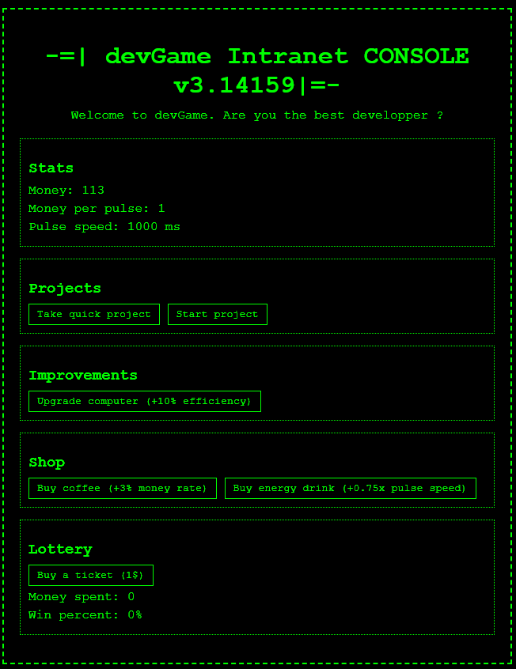

# 🚀 DevGame Intranet Console Game

Welcome to **DevGame Intranet Console** – a retro, terminal-style incremental game inspired by classic idle games like *Cookie Clicker* and *Adventure Capitalist*. This game is designed to give you a nostalgic experience with green-on-black console aesthetics, using only **HTML**, **CSS**, and **JavaScript**. Your goal? Become the richest person in the world by taking on projects, upgrading equipment, and optimizing your pulse rate! 💰

 <!-- Update with the path to your game screenshot -->

## Table of Contents
- [Features](#features)
- [Installation](#installation)
- [How to Run](#how-to-run)
- [How It Works](#how-it-works)
- [Expanding the Game](#expanding-the-game)
- [License](#license)

---

## Features 🎮

- **Retro Aesthetic**: Green text on a black background with a nostalgic console look.
- **Idle Mechanics**: Earn passive income over time with a pulse mechanic.
- **Shop and Upgrades**: Buy items to increase your income or reduce pulse intervals.
- **Projects**: Complete projects for extra rewards.
- **Lottery**: Test your luck in the lottery for a chance at a big win.

---

## Installation 📥

To get started with this game, follow these steps:

1. **Clone the Repository**:
   ```bash
   git clone https://github.com/SkyBlyvion/DevGameV1.git
   ```
   
2. **Navigate to the Project Folder**:
   ```bash
   cd DevGame-intranet-console
   ```

3. **Ensure All Files Are Available**: Make sure you have `index.html`, `styles.css`, and `script.js` in the project folder.

---

## How to Run 🚀

1. **Open `index.html` in Your Browser**: No additional setup is needed.
   
   - Simply double-click on `index.html` or drag it into a browser window.

2. **Enjoy the Game!**: You’ll see the retro console interface, where you can start clicking buttons to earn money, take projects, and upgrade your setup.

---

## How It Works ⚙️

This game is built using **HTML**, **CSS**, and **JavaScript** with no external libraries required. Here’s an overview of how each component works:

### HTML
- Provides the **structure** of the game.
- Divides sections into containers like **Stats**, **Projects**, **Shop**, **Improvements**, and **Lottery**.
- Each button triggers JavaScript functions to simulate player actions.

### CSS
- Creates the **retro console appearance** with green text on a black background.
- Adds **borders** and **dashed lines** to give each section a classic terminal look.
- Styled buttons, sections, and text give the game its nostalgic feel.

### JavaScript
- Implements the **core game logic** and controls the game’s state.
- Uses **variables** to keep track of money, pulse rate, and upgrades.
- Functions for each button let players:
  - **Earn money** passively based on pulse rate.
  - **Purchase upgrades** that improve earnings or reduce pulse delay.
  - **Take projects** to gain extra rewards.
  - **Participate in a lottery** for a chance to win extra money.

---

## Expanding the Game 🌟

If you’d like to make the game more interesting, here are some ideas for expanding it:

1. **Achievements** 🏆: Add milestones that unlock bonuses or rewards as the player reaches specific goals.
   
2. **Levels and Progression** 📈: Introduce levels that progressively unlock new content and challenges.
   
3. **Save Game Feature** 💾: Use `localStorage` to save game progress, so players can continue where they left off.

4. **New Projects and Upgrades** 🔧: Add more project types, jobs, or items in the shop to provide variety.

5. **Prestige System** 🔄: Implement a prestige mechanic that lets players "restart" with bonuses, increasing replayability.

Notes: 
- Implements a box next to Stats;  "Search for a job" and fun dev names, like ( Front, Back, Sec, FullStack ...), 3 jobs max.
- Implements the Lottery effectively 
- Refactor improvements

---

## Example Code Snippet 💻

Here's a quick look at the gameState object, it encapsulates:

Game Variables: money, moneyPerPulse, pulseSpeed.
Pulse Interval: Tracks the current earning interval.
Cached DOM Elements: Frequently accessed elements for updating stats efficiently.

```javascript
const gameState = {
    money: 100, // Starting money
    moneyPerPulse: 1, // Earnings per pulse
    pulseSpeed: 1000, // Interval duration (ms) for earnings
    pulseInterval: null, // ID of the interval timer
    elements: {
        moneyDisplay: document.getElementById('money'),
        moneyPerPulseDisplay: document.getElementById('money-per-pulse'),
        pulseSpeedDisplay: document.getElementById('pulse-speed')
    }
};
```

---

## Features


## License 📜

This project is licensed under the MIT License. You’re free to use, modify, and distribute it as you like.

---

Happy coding, and enjoy becoming the best developer in the virtual world of **DevGame**! 💸✨


## installation eslint

- 1. npm init -y
- 2. npm init @eslint/config
### Run
- npx eslint optimized_game.js 
### Run On Clone
- npm install & npx eslint optimized_game.js 

- if old Version 
- sudo apt remove nodejs
- curl -o- https://raw.githubusercontent.com/nvm-sh/nvm/v0.39.4/install.sh | bash
- source ~/.bashrc
- nvm install --lts
- node -v
- npm -v

## installation stylelint
- npm install stylelint stylelint-config-standard --save-dev
### Run
- npx stylelint "**/styles.css"
### Run On Clone
- npm install & npx stylelint "**/styles.css"

```

```

